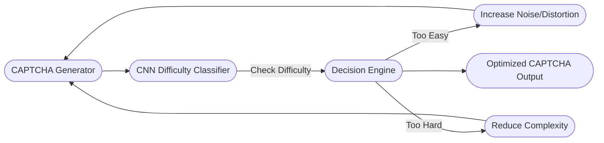

<div align="center">
  
</div>


<h1 align="center">
  <span style="background: linear-gradient(90deg, #ff7eb3, #ff758c, #ff6a88, #ff99ac); -webkit-background-clip: text; color: transparent;">
    🤖 ML-Enhanced CAPTCHA Refinement System 🔐
  </span>
</h1>

<h3 align="center">AI-powered Adaptive CAPTCHA Generator & Difficulty Optimization System</h3>

<p align="center">
  
  
  
  
  
</p>

---

# 🌐 **Live Demo**

<p align="center">
  <a href="https://sam-ml-captcha-refinement.streamlit.app/" target="_blank">
    
  </a>
</p>

---

# 🎯 **Project Overview**

The **ML-Enhanced CAPTCHA Refinement System** intelligently generates, classifies, and adjusts CAPTCHA difficulty levels using a hybrid of:

✔ Computer Vision
✔ Deep Learning
✔ Real-time adaptive feedback
✔ Streamlit interactive UI

Designed to balance **human accessibility** with **maximum bot resistance**, this system dynamically fine-tunes CAPTCHA complexity using a CNN classifier.

---

# ✨ **Key Capabilities**

### 🔐 **1. Smart CAPTCHA Generator**

* Adjustable **noise**, **distortion**, **clutter**
* Fully randomized CAPTCHA text
* Strong visual variations for training

### 🤖 **2. CNN Difficulty Classifier**

* 6000 labeled images (easy/medium/hard)
* 95% validation accuracy
* TensorFlow + Keras lightweight CNN

### 🔄 **3. Adaptive Refinement Loop**

* Predict → Adjust → Re-generate → Finalize
* Ensures target difficulty is achieved
* Ideal for **real-time security** use cases

### 🎨 **4. Beautiful Streamlit Interface**

* Dark mode, gradient UI, live preview
* Adjustable sliders
* Instant CAPTCHA download

---

# 🧠 **System Architecture**



---

# 📁 **Project Structure**

```
ML-CAPTCHA-Refinement/
│
├── src/
│   ├── generator.py        # CAPTCHA generation logic
│   ├── refine_m.py         # Difficulty refinement loop
│   ├── train_model.py      # CNN model training
│   ├── app.py              # Streamlit web app
│
├── models/
│   └── captcha_model.keras # Trained CNN model
│
├── data_preprocessed/      # Preprocessed CAPTCHA dataset
├── requirements.txt
└── README.md
```

---

# ⚙️ **Installation & Setup**

## 🔧 Step 1 — Clone Repository

```bash
git clone https://github.com/your-username/ML-CAPTCHA-Refinement.git
cd ML-CAPTCHA-Refinement
```

## 🧰 Step 2 — Create Virtual Environment

```bash
py -3.11 -m venv venv
venv\Scripts\activate
```

## 📦 Step 3 — Install Dependencies

```bash
pip install --upgrade pip
pip install -r requirements.txt
```

## 🚀 Step 4 — Launch App

```bash
streamlit run src/app.py
```

---

# 🧪 **Machine Learning Deep Dive**

### 🖼 Dataset

* 6000 images
* 3 difficulty levels:

  * Easy (clean)
  * Medium (moderate noise)
  * Hard (heavy distortion)

### 🧠 CNN Model

* Conv2D → ReLU → MaxPooling
* Conv2D → ReLU → MaxPooling
* Dense Layer
* Softmax classifier
* Trained using Adam optimizer
* Categorical Crossentropy

### 🔄 Refinement Algorithm

1. Generate CAPTCHA
2. Predict difficulty
3. Adjust noise/distortion
4. Iterate until target difficulty achieved

---

# 📸 Screenshots (Add Your Images)

| CAPTCHA Generator  | Refinement Loop    |
| ------------------ | ------------------ |
| *(add screenshot)* | *(add screenshot)* |

---

# 🚀 **Future Enhancements**

* Audio CAPTCHA support
* Reinforcement Learning optimization
* Human feedback reinforcement
* Adversarial bot testing

---

# 👤 **Author**

<div align="center">
  <b>Sanyam Katoch</b>  
  <br>Machine Learning & Computer Vision Developer  
  <br>
  <a href="https://github.com/sanyam-katoch10">
    
  </a>
</div>

