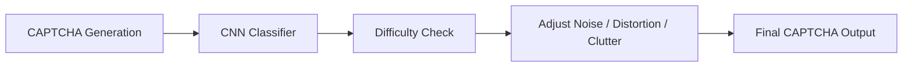

<div align="center">
  
</div>

<h1 align="center" style="background: linear-gradient(90deg,#ff416c,#ff4b2b); -webkit-background-clip: text; color: transparent;">
  ✨ ML-Enhanced CAPTCHA Refinement System ✨
</h1>
<h3 align="center">AI-Powered Adaptive CAPTCHA Generator & Difficulty Classifier</h3>

<p align="center">
  <a href="#"></a>
  <a href="#"></a>
  <a href="#"></a>
  <a href="#"></a>
  <a href="#"></a>
</p>

---

## 🌐 Live Demo

<p align="center">
  <a href="#" style="font-size:18px; text-decoration:none; color:white; background: linear-gradient(90deg,#ff416c,#ff4b2b); padding:12px 24px; border-radius:12px; transition: all 0.3s ease;" onmouseover="this.style.transform='scale(1.1)'" onmouseout="this.style.transform='scale(1)'">🚀 Coming Soon</a>  
</p>

---

## 🎯 Project Overview

The **ML-Enhanced CAPTCHA Refinement System** automatically generates CAPTCHAs and fine-tunes their difficulty with a **CNN classifier**.

<div align="center">
  <span style="color:#00bfff;font-weight:bold">✅ Human Readability</span> &nbsp;&nbsp;
  <span style="color:#ff8c00;font-weight:bold">✅ Bot Resistance</span> &nbsp;&nbsp;
  <span style="color:#32cd32;font-weight:bold">✅ Security & Usability</span>
</div>

---

## ✨ Features

<details>
<summary>🔐 Smart CAPTCHA Generator</summary>

* Adjustable **noise**, **distortion**, and **clutter**
* Randomized text generation
* Fully image-based CAPTCHA pipeline

</details>

<details>
<summary>🤖 CNN Difficulty Classifier</summary>

* Trained on 6,000 synthetic images
* Achieves high accuracy (>90%)
* TensorFlow/Keras-based CNN

</details>

<details>
<summary>🔄 Adaptive Refinement Loop</summary>

* Predict → Adjust → Re-generate → Repeat
* Ensures output matches target difficulty
* Optimized for **real-time applications**

</details>

<details>
<summary>🎨 Streamlit Web Interface</summary>

* Dark-themed, modern UI
* Interactive sliders for live adjustment
* Real-time CAPTCHA preview + download
* Smooth, responsive, real-time experience

</details>

---

## 🧠 Architecture Diagram



---

## 📁 Project Structure

```
ML-CAPTCHA-Refinement/
│
├── src/
│   ├── generator.py        # CAPTCHA generation
│   ├── refine_m.py         # Difficulty refinement
│   ├── train_model.py      # CNN training
│   ├── app.py              # Streamlit app
│
├── models/
│   └── captcha_model.keras # Pretrained ML model
│
├── data_preprocessed/      # Preprocessed CAPTCHA dataset
├── requirements.txt
└── README.md
```

---

## 🚀 Installation & Setup

<details>
<summary>Click to expand 🔧</summary>

### 1️⃣ Clone Repository

```bash
git clone https://github.com/your-username/ML-CAPTCHA-Refinement.git
cd ML-CAPTCHA-Refinement
```

### 2️⃣ Create Virtual Environment

```bash
# Windows
py -3.11 -m venv venv
venv\Scripts\activate.ps1

# macOS/Linux
python3.11 -m venv venv
source venv/bin/activate
```

### 3️⃣ Install Dependencies

```bash
pip install --upgrade pip
pip install -r requirements.txt
```

### 4️⃣ Run Streamlit App

```bash
streamlit run src/app.py
```

</details>

---

## 🧪 Machine Learning Details

<details>
<summary>Click to expand 🧠</summary>

### Model

Lightweight **CNN** for CAPTCHA difficulty classification.

### Training Highlights

* Dataset: 6,000 labeled images (easy/medium/hard)
* Layers: Conv2D + MaxPooling + BatchNorm + Dense
* Optimizer: Adam
* Loss: Categorical Crossentropy
* Dropout Regularization
* Validation Accuracy: >90%

### Refinement Logic

1. Generate CAPTCHA
2. Predict difficulty
3. Adjust noise/distortion/clutter
4. Repeat until target difficulty is achieved

</details>

---

## 📸 Screenshots

<details>
<summary>Click to expand 🖼️</summary>

### Generator UI

*(Add screenshot here)*

### Refinement Mode

*(Add screenshot here)*

### Confusion Mastrix
<p align="center">
  
</p>

</details>

---

## 💡 Future Enhancements

* Reinforcement learning-based difficulty tuning
* Human feedback loop integration
* Audio CAPTCHAs & image puzzles
* Adversarial bot-resistance testing

---

## 👨‍💻 Author

**Sanyam Katoch**
ML • AI • Computer Vision
[GitHub](https://github.com/sanyam-katoch10)
